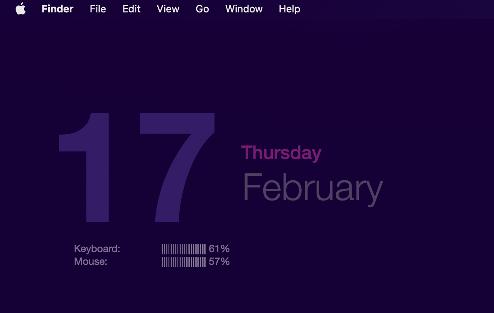

# Bluetooth Battery Percentage M1





I use a tool called **GeekTool** to show the battery percentage of my bluetooth connected devices on my desktop. It makes it easier to keep an eye on them and know when they need charged. 

Since switching to an Apple M1 laptop my old script broke, so I took a little time to update it. I used to pull the information from `system_profiler` but it seems it's been removed. The `ioreg` command, now list the current battery percentage of any bluetooth connected devices. You can parse the output from there to get exactly what you want.

```shell
ioreg -r -l -k "BatteryPercent"  
```
