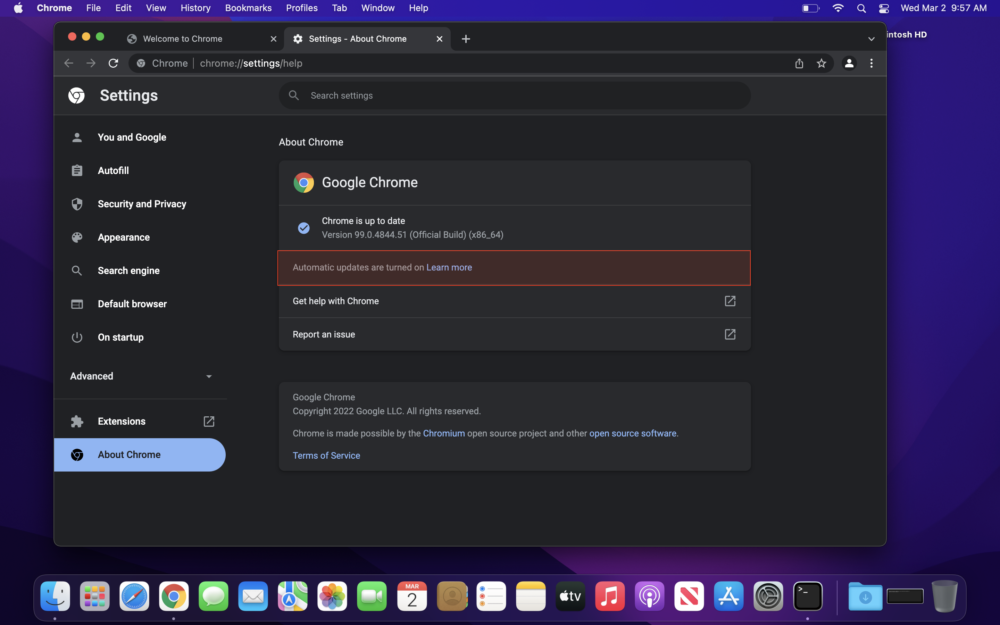

# Enable Chrome Autoupdate For All Users

Meant to be run after installing Chrome for the first time on a machine to enable auto updates for all users. 

Run the script with `Sudo` to install to the system wide location at ` /Library/Google` instead of the user location at `~/Library/Google`

To check settings after running:

- Open Chrome
- Click on `Chrome` in upper left menu bar
- Click on `About Google Chrome`
- Check update settings

