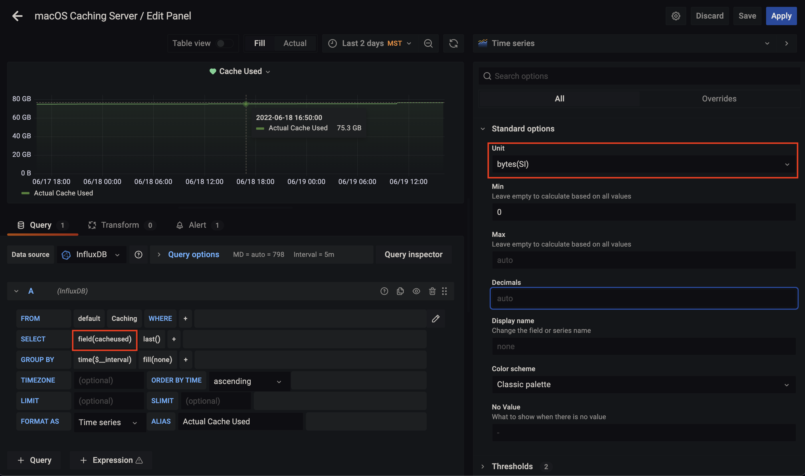
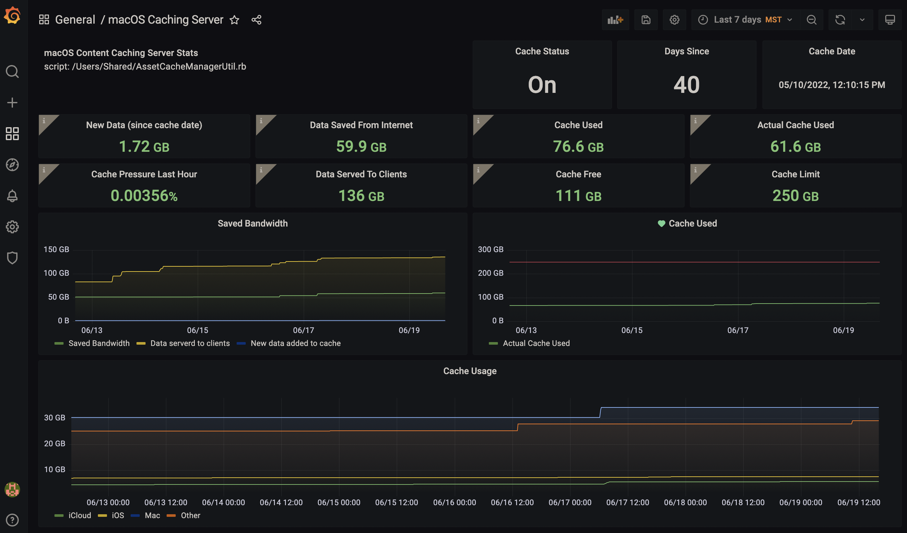

# macOS Content Caching Metrics


Content caching is a service in macOS that speeds up downloading of software distributed by Apple and data that users store in iCloud by saving content that local Apple devices have already downloaded.  If you've enabled it in "System Preferences > Sharing > Content Caching". You know that it couldn't be easier to set up. But have you ever wondered, what is content caching doing? Is it even working?

Luckily Apple has provided the `AssetCacheManagerUtil` command-line tool to manage content caching, with the `status` option that will output some metrics

```bash
AssetCacheManagerUtil status                                                          
2022-06-19 15:14:20.159 AssetCacheManagerUtil[95604:12021093] Content caching status:
    Activated: true
    Active: true
    ActualCacheUsed: 61.6 GB
    CacheDetails: (4)
        iCloud: 5.62 GB
        iOS Software: 7.54 GB
        Mac Software: 34.31 GB
        Other: 29.13 GB
    CacheFree: 110.83 GB
    CacheLimit: 250 GB
    CacheStatus: OK
    CacheUsed: 76.6 GB
    MaxCachePressureLast1Hour: 0%
    Parents: (none)
    Peers: (none)
    PersonalCacheFree: 110.83 GB
    PersonalCacheLimit: 250 GB
    PersonalCacheUsed: 5.62 GB
    Port: 56183
    PrivateAddresses: (1)
        10.0.1.102
    PublicAddress: xx.xx.xx.xx
    RegistrationStatus: 1
    RestrictedMedia: false
    ServerGUID: D2BE5986-6E42-41AC-845D-27A87C6EE6B6
    StartupStatus: OK
    TetheratorStatus: 0
    TotalBytesAreSince: 2022-05-10 12:10:15
    TotalBytesDropped: 7.3 MB
    TotalBytesImported: 1.72 GB
    TotalBytesReturnedToChildren: Zero KB
    TotalBytesReturnedToClients: 135.66 GB
    TotalBytesReturnedToPeers: Zero KB
    TotalBytesStoredFromOrigin: 59.88 GB
    TotalBytesStoredFromParents: Zero KB
    TotalBytesStoredFromPeers: Zero KB
```

This is a good start but you might want to know, what does `TotalBytesReturnedToClients` mean? You can reference all the metrics in [Apple's Developer Docs](https://developer.apple.com/documentation/devicemanagement/contentcachinginformationresponse/statusresponse?changes=latest_minor). Where we can find that `TotalBytesReturnedToClients` is:

> The amount of data, in bytes, that the content cache served to client iOS, macOS, and tvOS devices since the `TotalBytesAreSince` date.

This is progress. But the `AssetCacheManagerUtil` tool spits out one large json output. How can I pull individual metrics?

`jq` is a lightweight and flexible command-line JSON processor that can be easily installed with home-brew.

```bash
brew install jq
```

 And with the below command, you can parse the output for a single metric:

```bash
AssetCacheManagerUtil status -j 2>/dev/null | jq '.result.TotalBytesReturnedToClients'
135658827669
```

But now you'll notice the output isn't nice and human-readable like it was before we parsed it, jq will return values in bytes. You'll need to convert it to MB's or GB's if you want.

Now that we can use `jq` , we can pull the metrics we care about:

```bash
AssetCacheManagerUtil status -j &>/dev/null | jq '.result.Active'  
AssetCacheManagerUtil status -j &>/dev/null | jq '.result.ActualCacheUsed'  
AssetCacheManagerUtil status -j &>/dev/null | jq '.result.CacheDetails.iCloud' 
AssetCacheManagerUtil status -j &>/dev/null | jq '.result.CacheDetails."iOS Software"'  
AssetCacheManagerUtil status -j &>/dev/null | jq '.result.CacheDetails."Mac Software"'   
AssetCacheManagerUtil status -j &>/dev/null | jq '.result.CacheDetails.Other' 
AssetCacheManagerUtil status -j &>/dev/null | jq '.result.CacheFree' 
AssetCacheManagerUtil status -j &>/dev/null | jq '.result.CacheUsed'  
AssetCacheManagerUtil status -j &>/dev/null | jq '.result.CacheLimit' 
AssetCacheManagerUtil status -j &>/dev/null | jq '.result.MaxCachePressureLast1Hour' 
AssetCacheManagerUtil status -j &>/dev/null | jq '.result.TotalBytesReturnedToClients' 
AssetCacheManagerUtil status -j &>/dev/null | jq '.result.TotalBytesStoredFromOrigin' 
```

----

## Visualizing macOS Content Cache Metrics

I'll a big fan of Grafana and Influxdb, so it only makes sense for me to send these metrics to Influxdb so I can build a dashboard with Grafana. What's nice about sending it to influxdb is you don't have to convert the bytes, that can be handled directly in Grafana while building the dashboard.

I use the `AssetCacheManagerUtil.rb` script, which runs the `AssetCacheManagerUtil` command and sends the data to influxdb.



Then I create a dashboard in Grafana, add a new panel, and select `Caching` as the measurement. Here I'm selecting the variable `cacheused` from my ruby script.



After everything is said and done, I have a whole dashboard and finally have some visibility into what caching server is doing, and how much bandwidth it's saving me.
